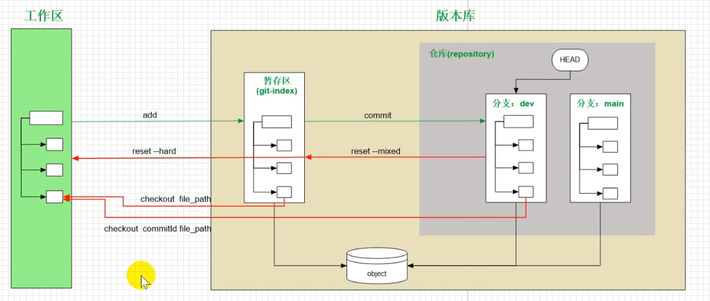

# Git分布式版本控制工具

### 版本控制器的方式

~~~
a、集中式版本控制工具
	版本库是集中存放在中央服务器的，必须联网才能工作。个人修改后提交到中央版本库
SVN和CVS
b、分布式版本控制工具
	没有“中央处理器”，每个人电脑都是一个完整的版本库
~~~

### Git常用命令

- ls/ll 查看当前目录
- cat 查看文件内容
- touch 创建文件

Git GUI：Git提供的图形界面工具

Git Bash：Git提供的命令行工具

### Git基本配置

#### 设置用户信息：

~~~
git config --global user.name ...
git config --global user.email ...
~~~

#### 查看配置信息

~~~
git config --global user.name
git config --global user.email
~~~

#### 为常用指令配置别名

1、打开用户目录，创建`.bashrc`文件

~~~
touch ~/.bashrc
~~~

2、在`.bashrc`文件中输入

~~~python
#用于输出git提交日志
alias git-log='git log --pretty = oneline --all --graph --abbrev-commit'
# 用于输出当前目录所有文件及基本信息
alias ll='ls -al'
~~~

3、执行 

~~~
source ~/.bashrc
~~~

### 获取本地仓库

1）在你需要的本地仓库文件夹右键打开Git Bash窗口

2）执行命令git init

3）看到文件夹中的`.git`文件夹

### 基础操作指令

 #### 查看修改的状态

~~~
git status
~~~

#### 添加工作区到暂存区

~~~
git add .
~~~

#### 提交暂存区到本地仓库

~~~
git commit -m '注释内容'
~~~

#### 查看提交日志(log)

~~~
git log --all 显示所有分支
git --pretty=oneline 将提交信息显示为一行
git --abbrev-commit 使输出的更简短
git --graph 以图的形式显示
~~~

~~~
git log --pretty=oneline --abbrev-commit --all --graph
~~~

 #### 版本回退

~~~
git reset --hard commitID
git reflog 查看已经删除的提交记录
~~~

#### 添加文件至忽略列表

~~~
.gitignore //新建文件将需要忽略的文件名写入
~~~

### 分支

 #### 查看本地分支

~~~
git branch
~~~

#### 创建本地分支

~~~
git branch 分支名
~~~

#### 切换分支

~~~
git checkout 分支名

切换到一个不存在的分支,创建并切换
git checkout -b 分支名
~~~

#### 合并分支

~~~
git merge 分支名
~~~

#### 删除分支

不能删除当前分支,只能删除其他分支

~~~
git branch -d b1 删除分支时,需要做各种检查
git branch -D b1 不做任何检查,强制删除
~~~

#### 解决冲突

两个分支上修改同一个文件同一行,需要手动解决冲突

1. 处理文件冲突的地方
2. 将解决完的冲突加入暂存区
3. 提交到仓库

### 开发中分支使用原则与流程

一般:

- master (生产)分支
- develop(开发)分支

### Git远程仓库

#### 添加远程仓库

~~~
git remote add <远端名称><仓库路径>
~~~

远端名称,默认是origin, 取决于远端服务器设置

仓库路径,从远端服务器获取此URL

例如:

~~~
$ git remote add origin https://gitee.com/xiaoluosigitee/learn-git_test01.git
~~~

#### 查看远程仓库

~~~
git remote
~~~

#### 推送到远程仓库

~~~
git push [-f] [--set-upstream][远端名称[本地分支名称]:[远端分支名]]
-f表示强制覆盖
--set-upstream推送到远端的同时并且建立起和远端分支的关联联系
~~~

#### 本地分支与远端分支的关联关系

~~~
git branch -vv
~~~

#### 从远程仓库克隆

~~~
git clone <仓库路径>[本地目录]
~~~

# .gitignore

### 模式匹配

1. 空行不匹配任何文件,因此常用作分隔符
2. #用于注释,\表示转义(如需使用实体\,则要加"\\")
3. *可以匹配任何字符(0次或多次),?可以匹配任何字符(1次)
4. /用于分隔目录
   1. 当/在开头时,表示.gitignore文件所在目录开始匹配.否则,下级都将匹配
   2. 当/在末尾时,只匹配目录,否则,则同名的目录和文件都将匹配
5. 原先被排除的文件,使用!模式后该文件将会重新被包含.**但如果该文件的父级目录被排除了,那么使用!也不会再次被包含**
6. []通常用于匹配一个字符列表,如a[mn]z可匹配amz和anz
7. **  用于匹配多级目录,如 a/**/b 可匹配 "a/b" "a/x/b" "a/x/y/b" 等

~~~.git
# 1.忽略所有内容
*

# 2.忽略所有目录
*/

# 3.忽略public目录下的所有文件,除了favicon.ico文件
public/*
!public/favicon.ico

# 4.只保留public目录下的a{一个字符}z.{后缀名}的所有文件
/*  忽略所有
!/public/ 保留public文件下的所有
/public/* 忽略public文件下的所有
!/public/a?z.* 保留要求的文件
~~~

### 规则检查

回车后有输出,说明被忽略

~~~
git check-ignore -v {文件或目录命令}
~~~

查看哪条规则对文件忽略:

~~~
git check-ignore -v {文件或目录名}
~~~

### 注意事项

**.gitignore只能忽略哪些没有被追踪的文件**,所以先纳入版本管理后写入.gitignore是无效的

解决方法

>先删除本地缓存,之后再加入

~~~
git rm -r --cached .
git add .
git status
~~~

同样的已被.gitignore忽略的文件也是无法加入版本库的

要纳入版本管理,先移除规则

# 从版本库中恢复文件

> **检出 git checkout**

### 已删除(或修改) 未add

表示从暂存区恢复到工作区

~~~
git checkout {文件路径} 
~~~

### 已删除(或修改) 已add 未commit

~~~
git checkout {commitID} {文件路径}
~~~

### 已删除(或修改) 已commit

>第n次修改改错了,需要退回到上一次

~~~
git checkout {n-1次commitID} {文件路径}
~~~

# 版本库建设中的分支管理

>分支可以理解为当前工作目录的一个副本

