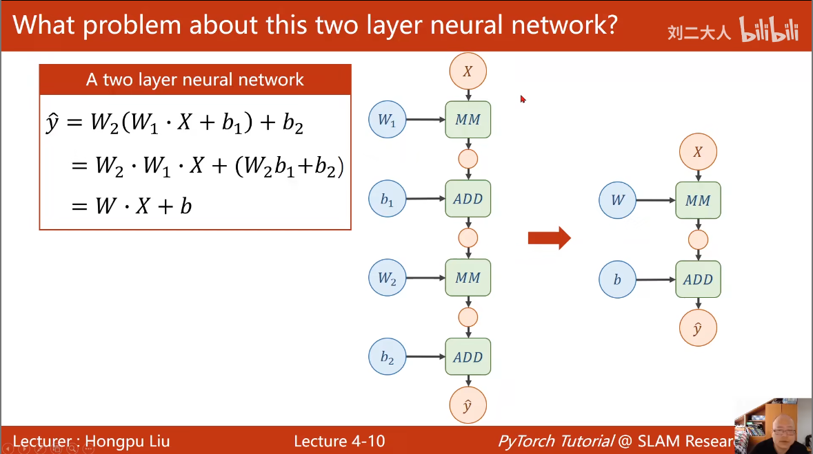
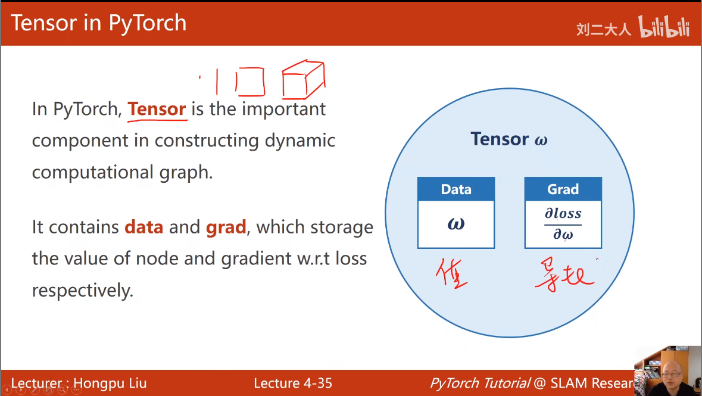
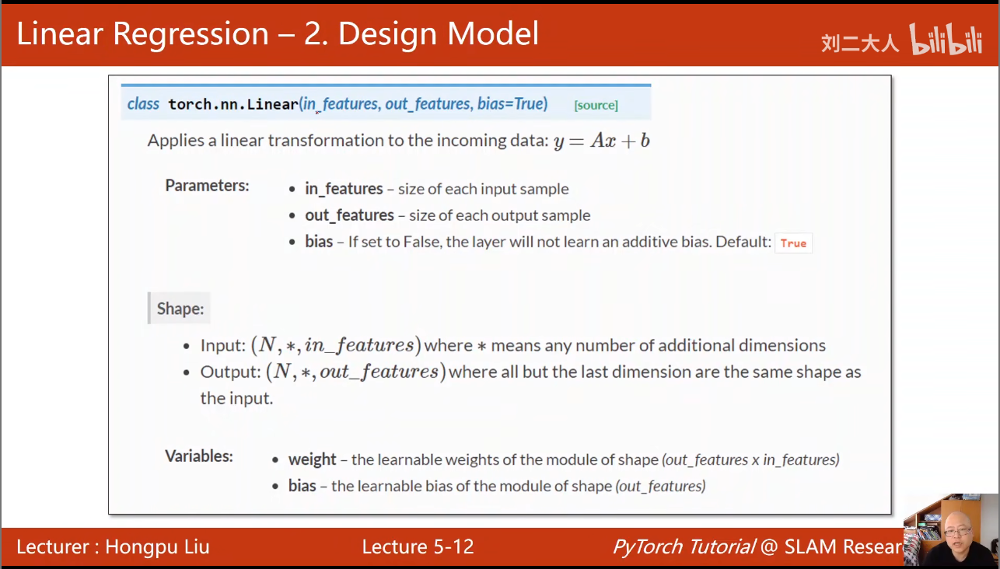

## Mini-batch

在深度学习中，我们训练模型的目标是通过一组样本数据来更新模型的参数。这个过程中涉及到一个叫 **梯度下降（Gradient Descent）** 的优化方法。而 **mini-batch** 就是梯度下降中的一种 **数据处理方式**。

通俗地说：

> **mini-batch 就是“每次训练只用部分数据”来更新模型，而不是一次用全部或一条数据。**

假设你有一个数据集，共有 **10000 条样本**。你设置 mini-batch 大小为 100。那么：

1. 你会将整个数据集**切成 100 个小批次**，每个批次 100 条样本。
2. 模型每次从一个 mini-batch 中取出数据，计算损失函数和梯度，更新模型参数。
3. 一轮训练结束，称为 **一个 epoch**。
4. 下一轮重新分组（可打乱顺序），继续训练。

| 优点       | 说明                                            |
| ---------- | ----------------------------------------------- |
| 💨 更快     | 相比整批数据，mini-batch 每次处理数据少，迭代快 |
| 📉 稳定性好 | 相比一条数据（SGD），平均多个样本的梯度更稳定   |
| 🧠 更好泛化 | 随机选取小批量，有助于模型学习更一般化的特征    |
| 🧮 硬件友好 | 特别适合 GPU 并行处理                           |


## 系数 = 系数 - 学习率 * grad

`grad` 是导数，表示 **当前参数对损失函数的影响方向和大小**

假设我们的损失函数是：

$$
Loss(w) = (w * x - y)^2
$$
我们对 `w` 求导数，得到：

$$
grad=dLoss/dw=2x(w∗x−y)
$$
这个导数告诉我们：

> 如果我们把 `w` **稍微加一点点**，损失函数是会上升还是下降。

✅ 如果 `grad > 0`

说明 `w` 太大了，应该往**小方向**调整。
 ➡ 所以我们要 `w = w - α * grad`

✅ 如果 `grad < 0`

说明 `w` 太小了，应该往**大方向**调整。
 ➡ 还是用同样的公式：`w = w - α * grad`，这时减负数，相当于加！


## 大型神经网络是怎么“自己求导数、更新参数”的呢？

**自动求导**（Autograd）这是 PyTorch、TensorFlow 等深度学习框架的“杀手级功能”。

### 🔄 什么是自动求导？

自动求导的本质就是：**用程序来自动计算每一个参数的梯度**。

它的核心思想叫做：

> **反向传播（backpropagation） + 链式法则（chain rule）**


~~~python
import torch

# 定义数据和参数（带 grad）
x = torch.tensor(2.0)
w = torch.tensor(3.0, requires_grad=True)

# 定义前向传播
y = x * w
loss = (y - 6)**2  # 目标值是6

# 反向传播
loss.backward()

# 查看梯度
print(w.grad)  # 输出梯度：2 * x * (x*w - y) = 2 * 2 * (6 - 6) = 0
~~~


~~~python
x = torch.tensor(2.0)
w = torch.tensor(3.0, requires_grad=True)
~~~

一旦你用 `torch.tensor(...)` 创建变量，**它就是 PyTorch 的张量对象 `torch.Tensor`**，而不是 Python 内建的 `float` 或 `int` 类型。

只有 `torch.Tensor` 类型，并且设置了 `requires_grad=True` 的变量，才能被 PyTorch **跟踪和记录操作历史**，从而实现自动求导！

### 自动反向传播

~~~python
loss.backward()
~~~

这是最重要的一行：

- 告诉 PyTorch：“现在请你**从 loss 开始，反向传播计算每个参数的梯度**。”
- PyTorch 会自动使用“链式法则”（Chain Rule）来计算所有带 `requires_grad=True` 的变量的 `.grad` 值。


小补充：`requires_grad` 的作用非常重要

| 参数                          | 含义                                            |
| ----------------------------- | ----------------------------------------------- |
| `requires_grad=False`（默认） | 不会记录梯度，也不会参与训练                    |
| `requires_grad=True`          | 表示这是**要训练的参数**，需要 PyTorch 自动求导 |

### 问题一

**如果我有两个结果（比如两个 loss），分别调用 `.backward()`，那 `x.grad` 和 `w.grad` 到底会存储哪一个的梯度**

PyTorch 的 `.grad` **默认只保存**：

> **上一次 `.backward()` 计算出来的梯度值，会覆盖之前的！**

如果你想**同时保留多个 `.backward()` 的影响**，你必须手动控制 —— **比如用 `retain_graph=True` 或者手动累加。**

### 问题二

你有一个 **计算链**：

```nginx
w ─┐
   ├──> y = x * w ──> z = y - 6 ──> loss = z²
x ─┘
```

然后你先做：

```python
z.backward()
```

再做：

```python
loss.backward()
```

然后你问：

> 现在 `w.grad` 存的到底是谁的梯度？是 `z` 对 `w` 的导数，还是 `loss` 对 `w` 的导数？

------

🎯 标准答案：

▶ `w.grad` 会存储的是 **两个 `.backward()` 计算的“累加值”**！

也就是说：

> **如果你没有在中间清除 `.grad`，它就会自动累加所有 `.backward()` 的梯度。**

❗ 所以你上面的情况中：

```python
z.backward()        # 会计算 dz/dw，并加到 w.grad 上
loss.backward()     # 会计算 dloss/dw，并加到 w.grad 上
```

最终：

```python
w.grad = dz/dw + dloss/dw
```

### 问题三

为什么是将两个求导结果相加呢？为什么要这样设计呢？

梯度加法的本质

🚀 1. **梯度** 是一个 **局部的变化率**

当我们计算损失函数（loss）对一个变量（例如 `w`）的梯度时，梯度表达了如果改变 `w` 的值，**损失函数**的变化量。

假设你有两个损失函数 `loss1` 和 `loss2`，它们依赖于相同的变量 `w`，并且在训练过程中你希望通过两个损失函数的影响来更新 `w`，那么**最终的梯度**应该是两个损失函数对 `w` 的 **梯度之和**。这是因为每一个损失函数 **独立地影响 `w`**，这两者的影响是可以叠加的。

🚧 2. **链式法则的支持**

根据链式法则，梯度的传播是逐步的。在 **多次 `.backward()`** 的情况下，每个损失函数的导数都代表了该损失函数相对于 `w` 的变化。你可以把这个过程理解为 **两个函数的梯度传递的合成**，因此最终的梯度是它们的加和。

例如：

- `loss1.backward()` 会计算 `∂loss1/∂w`
- `loss2.backward()` 会计算 `∂loss2/∂w`

如果你在同一个计算图中依赖于 `w` 的两个独立损失函数，那么总的梯度就应该是：
$$
\frac{\partial loss_1}{\partial w} + \frac{\partial loss_2}{\partial w}
$$
 **简化的类比：**

假设你有两个不同的错误来源，它们都影响了你做事的最终结果。你要采取的行动是同时修正这两个错误，而不是单独修正其中一个。通过加起来，你能一次性修正两个问题！

### [矩阵计算公式](https://www.math.uwaterloo.ca/~hwolkowi/matrixcookbook.pdf)


## 激活函数



我们发现不断进行线性变换，化简，最终，不管有多少层，都会化简为一层，因此我们在每一层后面都加上一层非线性的函数，来防止这种化简

- **两层神经网络的最终表达式化简后仍然是线性模型**，其本质上与单层神经网络没有区别。
- 如果没有引入非线性函数，网络的表达能力会受到限制，无法拟合复杂的非线性关系。

## pytorch tensor




## Pytorch_fashion

准备数据集

~~~python
x_data = torch.tensor([1.0, 2.0, 3.0])
y_data = torch.tensor([2.0, 4.0, 6.0])
~~~

构造模型



~~~python
class LinearModel(torch.nn.Module):
    def __init__(self):
        # 调用父类的构造
        super(LinearModel, self).__init__()
        # 构造一个对象linear 包含权重和偏置这两个参数
        self.linear = torch.nn.Linear(1, 1)

    def forward(self, x):
        y_pred = self.linear(x)
        return y_pred
~~~

为什么没有backward函数？

因为model构造出的对象它会根据你的计算图自动的实现backward的过程


构造损失函数和优化器

~~~python
criterion = torch.nn.MSELoss(reduction='sum')
optimizer = torch.optim.SGD(model.parameters(), lr=0.01)
~~~

训练周期

~~~python
for epoch in range(500):
    y_pred = model(x_data)
    loss = criterion(y_pred, y_data)
    print(epoch, loss.item())

    optimizer.zero_grad()
    loss.backward()
    optimizer.step() # 进行更新，根据参数和预先设置的学习率进行自动更新
~~~


### pytorch广播机制

在 PyTorch 中，广播机制（Broadcasting）是一种方便的功能，允许在形状不同的张量之间进行算术操作（如加法、乘法等），无需显式地调整维度。广播会自动扩展较小的张量以匹配较大的张量形状，从而实现操作。

广播机制基于以下两条规则：

1. **从后向前匹配维度**：
   - 从两个张量的最后一个维度开始，逐个比较两个张量的维度。
   - 如果维度相同或其中一个维度为 1，则可以进行广播。
2. **缺失的维度视为 1**：
   - 如果一个张量的维度比另一个张量少，则在前面补充维度 1 进行匹配。

通过广播扩展张量时，不会真实地复制数据，而是通过在计算时“虚拟地”扩展形状来完成操作。这种方式既节省内存，又提高了效率。

示例 1：标量和张量的操作

~~~python
import torch

a = torch.tensor([1, 2, 3])
b = torch.tensor(2)
result = a + b  # 广播：b 被扩展为 [2, 2, 2]
print(result)  # 输出 [3, 4, 5]
~~~

示例 2：二维张量和一维张量的操作

~~~python
a = torch.tensor([[1, 2, 3], [4, 5, 6]])
b = torch.tensor([1, 2, 3])
result = a + b  # 广播：b 被扩展为 [[1, 2, 3], [1, 2, 3]]
print(result)
~~~

示例 3：不同形状的多维张量操作

~~~python
a = torch.tensor([[[1, 2, 3]], [[4, 5, 6]]])  # 形状 (2, 1, 3)
b = torch.tensor([[1, 2, 3]])                 # 形状 (1, 3)
result = a + b  # 广播：b 被扩展为 (2, 1, 3)
print(result)
~~~

广播机制的限制

- 如果两个张量在某个维度上不相等且其中一个维度也不是 1，则会报错。
- 广播机制要求形状能按照上述规则兼容，否则无法完成操作。

## 分类 vs 回归 得到结果的区别


| 类型     | 输出结果         | 举例                             |
| -------- | ---------------- | -------------------------------- |
| 分类任务 | 输出每类的概率值 | 数字识别（输出是每个数字的概率） |
| 回归任务 | 输出一个实数     | 房价预测、温度预测等             |

🎯 二、分类输出：为什么是概率？

在数字识别中，比如识别手写数字0~9，我们通常使用一个神经网络最后一层是**Softmax激活函数**。

Softmax 的作用：

假设模型输出一个向量：`[z0, z1, ..., z9]`（这叫logits）

然后我们用 Softmax 把它变成概率：
$$
p_i = \frac{e^{z_i}}{\sum_{j=0}^{9} e^{z_j}}
$$
最终得到一个概率分布，比如：

```text
[0.01, 0.02, 0.90, 0.01, 0.01, 0.01, 0.01, 0.01, 0.01, 0.01]
```

这就表示模型认为这个图片是 **数字2 的概率是 90%**，其他的都比较低。


| 对比点       | 分类（输出概率）                 | 回归（输出实数）                     |
| ------------ | -------------------------------- | ------------------------------------ |
| 输出形式     | 多个类别对应的概率（Softmax）    | 单个实数值                           |
| 损失函数     | 交叉熵（CrossEntropyLoss）       | 均方误差（MSE）或平均绝对误差（MAE） |
| 输出含义     | 每个类别的概率，最大者为预测类别 | 连续值本身，如温度、价格等           |
| 结果解释     | 看哪个概率最大                   | 直接使用输出值                       |
| 使用场景举例 | 数字识别、图片分类、人脸识别     | 房价预测、时间序列预测、年龄估计等   |


## logits数值


**logits 是模型输出层（在 Softmax 之前）的一组原始数值**，它们是模型还没变成概率前的“打分”。

举个例子：

假设我们有一个神经网络做数字识别（识别 0～9），最后一层输出是一个 10 维向量：

```text
logits = [2.3, 0.1, -1.2, 5.7, -0.5, 0.3, 1.1, -2.2, 3.2, -0.9]
```

这些数值本身不是概率，也不保证总和是1，它们是网络对每个类别的**打分或偏好程度**。

在分类任务中，我们通常不直接输出概率，而是先输出 logits：

1. logits 保留了更多信息（例如可能是正负数、范围不限）
2. 这些原始分数可以喂给 **Softmax** 函数，转化成概率分布

Softmax 是分类任务中常用的**激活函数**，它能把 logits 变成“每类的概率”

这个函数的特点是：

- 所有输出都 > 0
- 所有输出加起来是 1（构成一个概率分布）

所以，经过 Softmax 后：

```
logits: [2.3, 0.1, -1.2, 5.7, ...]
softmax: [0.02, 0.01, 0.001, 0.93, ...]
```

你可以看到最大的是 5.7 对应的类别 → 概率最大，预测为那个类别。


## 饱和函数

>**饱和函数**指的是输入值过大或过小时，**导数趋近于0**，导致网络难以训练（梯度消失）。
 最典型的是 sigmoid 和 tanh，现在多数深度学习任务用 **非饱和函数**（如 ReLU）代替。

**饱和函数（Saturating function）**是指：当输入值很大或很小时，**函数的导数（梯度）趋近于0**，输出值趋于一个固定值，几乎不变。

换句话说，它“饱和了”——再怎么改变输入，输出都基本不动了，梯度变得非常小。

🔁 饱和函数的常见例子

| 函数       | 是否饱和   | 饱和区间说明                  |
| ---------- | ---------- | ----------------------------- |
| Sigmoid    | ✅ 是       | x 很大或很小时，梯度趋近 0    |
| Tanh       | ✅ 是       | 输出范围 -1 ~ 1，类似 sigmoid |
| ReLU       | ❌ 不是     | 正区间不会饱和，负区间是 0    |
| Leaky ReLU | ❌ 基本不会 | 负区间也保留一点梯度          |

🧨 饱和函数的问题：梯度消失

当使用饱和函数（比如 sigmoid）的时候，输入如果太大或太小，梯度就很小，几乎为 0。这会导致：

- **前面层的参数无法更新**（梯度乘以很小的值越来越小）
- **网络训练变慢，甚至不收敛**

这就是经典的“**梯度消失问题**”。


## logitstic函数

logistic 函数（也叫 sigmoid 函数）

这是一个**具体的数学函数**，形式如下：
$$
\sigma(x) = \frac{1}{1 + e^{-x}}
$$
这个函数有个别名就叫：

- **logistic 函数**
- **sigmoid 函数**（深度学习里常用的说法）

它的特点：

- 输出范围在 (0, 1) 之间
- S 型曲线（类似“S”）
- 当输入 x 很大或很小时会饱和（梯度趋近于 0）


## 分布之间的差异

“分布之间差异”是啥意思？

> 含义：真实标签（P）和预测概率（Q）之间的不同

在深度学习里，模型的预测值（通常是 softmax 后的结果）其实是一个“概率分布”。

比如我们做 3 类分类问题：

```text
真实标签（one-hot）:      P = [1, 0, 0]
模型预测（softmax后）:   Q = [0.7, 0.2, 0.1]
```

这两个都是**分布**，表示对于每个类别的“概率”。

> 所以“分布之间的差异”就是：真实分布 P 和模型预测分布 Q 有多不一样。

我们希望模型预测的分布 Q **尽可能接近**真实的 P。


## KL散度

>  **KL 散度是衡量两个分布差异的指标**
>
> 它本质上是个“数值结果”，无法直接优化，它只是告诉我们预测得**准不准**

✅ KL 散度的定义：

KL 散度（Kullback–Leibler Divergence），用来衡量两个分布之间有多“远”：
$$
D_{KL}(P || Q) = \sum_i P(i) \log \left( \frac{P(i)}{Q(i)} \right)
$$
这里：

- P：真实分布（ground truth）
- Q：预测分布（模型输出）
- KL 散度越小，说明 Q 越接近 P

🔎 举个例子：

如果：

- 真实分布 P = [1, 0, 0]
- 模型预测 Q = [0.7, 0.2, 0.1]

则：
$$
D_{KL}(P || Q) = 1 \cdot \log\left(\frac{1}{0.7}\right) + 0 \cdot \log(\frac{0}{0.2}) + 0 \cdot \log(\frac{0}{0.1}) \\ = \log(1/0.7) ≈ 0.357
$$
这个值就是“预测偏离真实分布的程度”。


### 交叉熵不仅能衡量差异，还能用作损失函数

它有个很巧妙的数学性质：

> 优化交叉熵（最小化交叉熵） = 间接地最小化 KL 散度

因为这俩之间的关系是：
$$
交叉熵(P,Q)=熵(P)+KL散度(P∣∣Q)
$$
其中 熵(P) 是常数项（固定不变），所以我们优化交叉熵时，其实就是在让 KL 散度变小！


### 优化交叉熵 = 优化模型参数

最关键的一步！

我们不能直接“操作”KL散度，也不能直接“修改交叉熵”——我们能动手的，只有：

> **调整模型参数（权重 w、偏置 b）**

所以整个过程其实就是：

🧠 总流程：

```
css复制编辑模型输出 logits → 经过 sigmoid/softmax → 得到预测分布 Q → 
和真实分布 P 算交叉熵损失 →
反向传播这部分误差 →
调整网络权重 → 下一次预测更接近 P
```

从而：

📉 交叉熵 ↓
📉 KL 散度 ↓
📈 模型效果 ↑


### 我们用模型函数 f(x) 得到 y，再压缩 y 成概率值，为什么 f(x) 能转换成可压缩为概率的值？
 因为训练会调整 f(x) 的参数，让输出值（经 sigmoid 后）尽可能接近 0 或 1，从而让它“有意义地”代表概率。f(x) 的结构提供表达能力，训练过程让它学会如何表达。


### 也就是说，函数形式是随意的，比如 y = wx + x² + b 也可以训练出一个分类模型？

 对。你只要能写出一个可微分的函数，就能训练它，让它拟合数据。y = wx + x² + b 完全可以训练，只要有数据和梯度，就能找到最优参数。

### 那我们怎么知道该选什么样的函数？函数可以有无数种啊？

 我们通常遵循这几种策略：

- 从简单函数开始尝试，逐步增加复杂度
- 观察数据趋势来选函数
- 使用交叉验证自动选择
- 加正则防止过拟合
- 用神经网络自动拟合复杂函数
   选择函数的目标是：既能拟合数据，又不要太复杂。


## 模型训练的小总结

我们想要训练一个能够运用的模型，需要以下几个步骤

1、先收集数据集 x y 

2、选择模型函数 即选择一个合适的f(x) 

3、选择一个合适的损失函数 

4、开始训练 

训练过程：先将x传入我们的模型函数中得到一个y值，用得到的y值去和实际的y值进行计算损失函数，得到一个loss。再用这个loss反向传播，重新调整我们模型函数的系数。一轮一轮都是如此


## 激活函数的两种用法


 **1. 隐藏层中的激活函数：用于增加非线性表达能力**

> 用于防止多个线性层合并成一个等价的线性函数

比如：
$$
y = k(wx + b) + c \quad \text{仍然是线性}
$$
加上一个非线性函数，比如 ReLU、Tanh、Sigmoid，就无法再“合并简化”了：
$$
y = \text{ReLU}(wx + b) \quad \text{这就是非线性了}
$$
📌 **用途：**

- 增强模型的表达能力
- 让神经网络能拟合复杂函数（比如曲线、阶梯型、边界）

------

✅ **2. 输出层的激活函数：用于格式化最终输出（如概率）**

> 把模型的输出压缩到 [0, 1] 区间，解释为“预测为正类的概率”

比如逻辑回归：
$$
\hat{y} = \text{Sigmoid}(wx + b) \in (0, 1)
$$
📌 **用途：**

- 不是为了引入非线性
- 是为了让模型输出符合任务需求（比如概率）

| 层     | 操作             | 激活函数     | 作用               |
| ------ | ---------------- | ------------ | ------------------ |
| 输入层 | x                | 无           | 输入特征           |
| 隐藏层 | Linear → ReLU    | ✅ 非线性激活 | 增加表达能力       |
| 输出层 | Linear → Sigmoid | ✅ 压缩成概率 | 让输出可解释为概率 |


## 维度下降

输入层：

- **输入向量 X 是 8D（8维）**，比如一个特征是 `[x1, x2, ..., x8]`。

------

🧱 第一层 Linear Layer：

- 执行操作：
  $$
  z_1 = X \cdot W_1 + b_1
  $$
  

  - 这里 `W1` 是一个形状为 `[8, 6]` 的权重矩阵，把输入的 8 维转换成了 6 维。
  - `b1` 是偏置（bias），加到每一个输出单元上。

- 接着通过一个激活函数：
  $$
  o_1 = \sigma(z_1)
  $$

  - σ 通常是 ReLU、Sigmoid、Tanh 等

✅ 这个过程就完成了**从 8D → 6D** 的转换，**称为“降维”**（但其实是线性变换+非线性处理）。


为什么 linear layer 可以让维度“下降”？

因为它的本质是一个矩阵乘法：

输入 (n 维)⋅权重矩阵 (n × m)=输出 (m 维)

只要你定义权重矩阵的输出维度是小于输入的，维度就“降”下来了（其实是变换，不是删掉信息）。


激活函数不是用来降维的，而是：

- 引入**非线性变换**
- 防止多个线性层叠加成一个线性函数
- 让模型可以拟合复杂的非线性关系

如果不加激活函数，两层线性层会退化成一个线性变换，就没必要分两层了。